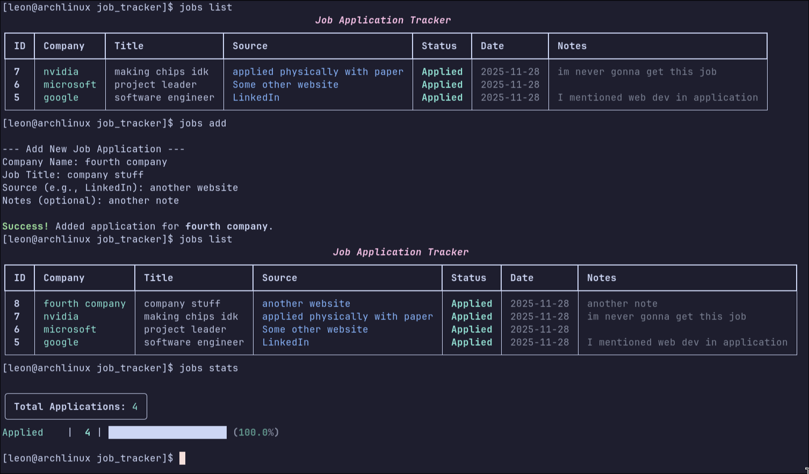

# CLI Job Tracker

A minimal, terminal-native job application tracker built with Python, SQLite and Rich. The purpose is to use it when applying to several jobs and internships, to quickly track everything related to each individual application.



## Quick Start

1. Installation:

```
# Set up environment and activate
python -m venv venv
source venv/bin/activate

# Install Rich library
pip install rich
```

2. Global Alias (makes life easier)
```

alias jobs="~/Code/projects/job_tracker/venv/bin/python ~/Code/projects/job_tracker/tracker.py"
```

Add this shortcut or something similar to your terminal for easy access. Change file paths.

## Commands

| Command | Action | Example |
| :--- | :--- | :--- |
| **`list`** | View all applications in the TUI table. | `jobs list` |
| **`add`** | Log a new application | `jobs add` |
| **`stats`** | View progress dashboard/summary. | `jobs stats` |
| **`update`** | Quick status change by Job ID | `jobs stats` |
| **`edit`** | jobs edit 1 | `jobs edit 1` |
| **`delete`** | Remove an entry by Job ID | `jobs delete 1` |


**Valid Statuses**: Applied, Interview, Offer, Rejected

tip: use `jobs -h` or `jobs --h` to display list of commands

## File Structure
- **tracker.py**: Main CLI logic.
- **database.py**: SQLite operations.
- **tracker.db**: Local database (Git ignored).

